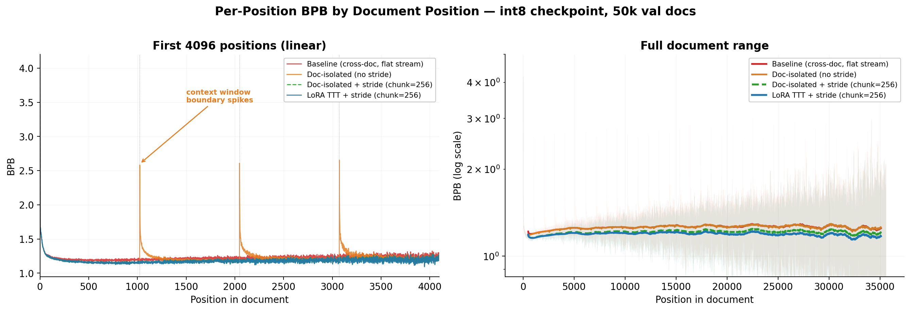

This record captures `LoRA TTT`: the naive baseline model with document-aware LoRA test-time training at evaluation.

## Method

**Training** is identical to the naive baseline.

**Evaluation** adds per-document LoRA test-time training (TTT). For each document in the validation set:
1. Find document boundaries using BOS tokens
2. Split the document into overlapping chunks (chunk_size=256 within eval_seq_len=1024 context windows)
3. For each chunk, score it (accumulate loss/bytes for BPB), *then* train rank-8 LoRA adapters on that chunk's loss (so you only train on the context -- no leakage)
4. Reset LoRA parameters between documents (no leakake across documents)

Documents are batched (batch_size=64) and sorted by length for efficiency. The LoRA adapters target `lm_head`, `c_q`, and `c_v` projections in all transformer blocks. A single Adam optimizer with `lr=0.01, betas=(0.9, 0.95)` trains all LoRA parameters with one gradient step per chunk.

## Notes

This is very similar to [a record I submmited to the modded nano-gpt speedrun repo](https://samacquaviva.com/projects/nanogpt/).
The major addition is to make the test-time training ~5x faster by using LoRAs: this let's you have per-sequence adaptation (no leaking between validation sequences) while still batching.

This is not a heavily optimized run: I just wanted to plant the TTT seed.
It uses ~1/10th of the evaluation budget.

## Ablations

The majority of this improvement doesn't come from the TTT itself, but from
1). Only conditioning on the current document
2). Doing strided evaluations

| Condition | val_loss | val_bpb | Delta bpb |
| --------- | -------- | ------- | --------- |
| Baseline (cross-doc, flat stream) | 2.0731 | 1.2278 | — |
| + Doc-isolated | 2.0561 | 1.2168 | -0.0110 |
| + Stride (chunk=256) | 2.0177 | 1.1941 | -0.0337 |
| + LoRA TTT | 2.0126 | 1.1910 | -0.0368 |



## Results

Validated on the full 50k-document fineweb_val split. Submitting at `bpb=1.195`.

```bash
bpb: [1.1927, 1.1935, 1.1921, 1.1929]
mean: 1.1928
std: 0.0005
p-value < 1.195: 0.00234486
```

## Command

```bash
torchrun --standalone --nproc_per_node=8 train_gpt.py
```

## Included files

- `train_gpt.py`
- `train_v*.txt` (note that `train_v0.txt` is on 2xH100)
- `submission.json`
